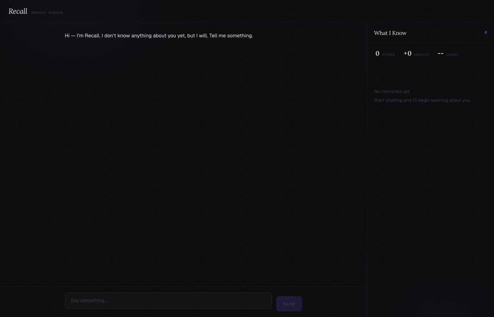

# Recall

An AI assistant that actually remembers who you are.

Most chatbots reset every time you close the tab. Recall doesn't. It picks up facts from your conversations — your name, your job, what you're working on, what you care about — and stores them as vector embeddings. Next time you come back, it already knows you. The more you talk to it, the sharper it gets.

**[Try it live](https://recall-ai-rishanshah0811-devs-projects.vercel.app)**



---

## What it does

When you chat with Recall, two things happen behind the scenes:

1. **Memory extraction** — After each exchange, Gemini analyzes the conversation and pulls out factual information (name, preferences, goals, job details). Each fact gets embedded as a vector and stored in Qdrant Cloud.

2. **Contextual retrieval** — When you send a new message, the system runs a semantic search against your stored memories. The most relevant ones get injected into the system prompt so the AI can reference them naturally, without you having to repeat yourself.

The right-side panel shows this happening in real time. You can watch memories appear, see their categories, and delete anything you want forgotten.

## Features

- Persistent memory across sessions using vector similarity search
- Real-time memory panel with live updates and category tagging
- SSE streaming responses (tokens render as they arrive)
- Automatic fact extraction and deduplication
- Memory categories: Personal, Professional, Preferences, Goals
- Delete individual memories with one click
- Mobile-responsive with a slide-up memory drawer
- Animated UI with motion/react (spring physics, staggered reveals)

## Tech stack

| Layer | Tech |
|-------|------|
| Framework | Next.js 16, TypeScript |
| Styling | Tailwind CSS v4, custom CSS variables |
| Animations | motion/react (springs, AnimatePresence, layout) |
| LLM | Gemini 3.6 Flash (chat + fact extraction) |
| Embeddings | Google gemini-embedding-2 (768-dim vectors) |
| Vector DB | Qdrant Cloud (semantic search, payload filtering) |
| Streaming | Server-Sent Events via ReadableStream |
| Deployment | Vercel (full stack) |

## How it works

```
User message
    │
    ├──▶ Semantic search against stored memories (Qdrant)
    │        │
    │        ▼
    │    Relevant memories injected into system prompt
    │        │
    │        ▼
    │    Gemini generates streamed response
    │        │
    │        ▼
    │    Tokens sent to client via SSE
    │
    └──▶ After response completes:
              │
              ▼
         Gemini extracts facts from the exchange
              │
              ▼
         New facts embedded and stored in Qdrant
              │
              ▼
         Memory panel updates in real time
```

## Run it locally

You'll need a [Qdrant Cloud](https://cloud.qdrant.io/) account (free tier) and a [Google AI Studio](https://aistudio.google.com/) API key.

```bash
cd frontend
npm install
```

Create `frontend/.env.local`:

```
GEMINI_API_KEY=your_key
QDRANT_URL=https://your-cluster.cloud.qdrant.io
QDRANT_API_KEY=your_key
DEFAULT_USER_ID=default_user
```

```bash
npm run dev
```

Open `http://localhost:3000`. Tell it your name, close the tab, come back, and ask if it remembers you.

## API routes

| Method | Path | What it does |
|--------|------|--------------|
| POST | `/api/chat/stream` | Streams a chat response via SSE |
| GET | `/api/memories` | Returns all stored memories for a user |
| DELETE | `/api/memories/[id]` | Deletes a specific memory |
| GET | `/api/memories/count` | Returns total memory count |
| GET | `/api/health` | Health check (includes Qdrant connection status) |

## Project structure

```
frontend/
├── app/
│   ├── api/                  # Server-side API routes
│   │   ├── chat/stream/      # SSE streaming endpoint
│   │   ├── health/           # Qdrant health check
│   │   └── memories/         # CRUD for memories
│   ├── page.tsx              # Main app layout (chat + memory panel)
│   ├── layout.tsx            # Root layout with fonts
│   └── globals.css           # Design tokens, animations, effects
├── components/
│   ├── ChatPanel.tsx         # Chat interface with input
│   ├── MessageBubble.tsx     # Individual message rendering
│   ├── MemoryPanel.tsx       # Right-side memory list
│   ├── MemoryCard.tsx        # Single memory with category + delete
│   ├── MemoryStats.tsx       # Memory count display
│   └── TypingIndicator.tsx   # Bouncing dots during streaming
├── hooks/
│   └── useSSE.ts             # Custom hook for SSE streaming
├── lib/
│   ├── api.ts                # Client-side API helpers
│   ├── types.ts              # TypeScript interfaces
│   └── server/               # Server-only modules
│       ├── chat.ts           # Gemini chat with memory context
│       ├── memory.ts         # Fact extraction, embedding, CRUD
│       ├── gemini.ts         # Gemini client singleton
│       └── qdrant.ts         # Qdrant client singleton
```
